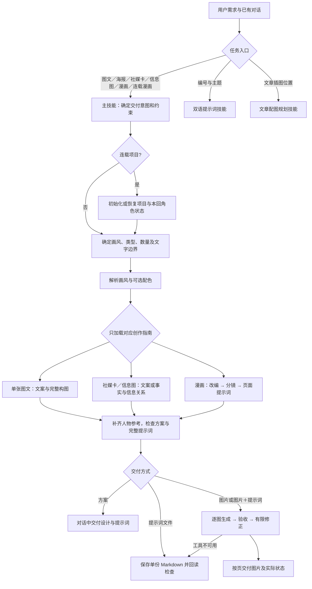

# 单张图文、海报、社媒卡、信息图、分镜漫画与连载漫画

推荐按 **画风 → 类型 → 文本** 提供需求，再补充需要控制的选项。可以一次发完，也可以分步告诉 AI；字段顺序不影响识别，已在对话中确定的内容无需重复。

画风决定“怎样画”，类型决定“用什么形式表达”，文本决定“表达什么”。排版或分镜是类型下的可选细化项，不是画风。所有类型都尊重所选画风，并在用户约束内保留创意空间。

## Skills 分工与调用关系

本项目以 `story-to-handdraw-comic` 为主入口，包含三个专用技能和一个风格库入口。它们按任务分流，不需要依次执行全部技能。

| 入口 | 负责什么 | 默认交付与边界 |
|---|---|---|
| [story-to-handdraw-comic](SKILL.md) | 将内容改编成单张图文、海报、社媒卡、信息图或漫画，并管理连载项目 | 根据请求交付方案、完整提示词文件或图片；连载模式额外保存跨章节角色、状态与参考图。 |
| [handdraw-style-prompter](assets/handraw-style/skills/handdraw-style-prompter/SKILL.md) | 已知画风编号＋主题的双语提示词 | 默认对话中给中英提示词；只有请求出图时生图。其纯图／图文包装不覆盖主技能已改编的文案。 |
| [article-illustration-planner](assets/handraw-style/skills/article-illustration-planner/SKILL.md) | 为文章安排插图位置、概念与提示词 | 默认保留文章，给插图规划和双语提示词；不是自动把整篇文章改成漫画。 |
| [handdraw-style-library](assets/handraw-style/SKILL.md) | 浏览资源及分流到上述风格库专用技能 | 包级兼容入口，不再与 `handdraw-style-prompter` 使用同一个发现名称。原 `$handdraw-style-prompter` 仍由专用技能承接。 |



主技能直接调用 `scripts/resolve_style.py` 获取风格数据；它复用底层解析器，**不调用独立提示词技能重新改写文案**。画风参考只管视觉语言，排版参考只管结构，人物照片只管对应角色外观。解析／普通创作只读资源，维护流程才修改风格库。

## 本地资料与离线预览

资源已对齐 [yang0/handraw-style 的固定版本 69b159c0a9b](https://github.com/yang0/handraw-style/tree/69b159c0a9b693f7b90dab856eef02466938b27d)，保留本技能原有的使用方式、创作规则和生成流程。

| 资料 | 当前范围 | 本地预览 |
|---|---|---|
| 画风 | 001–279，共 279 种 | [画风画廊](assets/handraw-style/skills/handdraw-style-prompter/gallery/index.html) |
| 主题色 | C-01–C-36，共 36 种 | [色彩画廊](assets/handraw-style/skills/handdraw-style-prompter/gallery/colors.html) |
| 社媒卡 | SC-001–SC-022，跳过 SC-013，共 21 种 | [社媒卡画廊](assets/handraw-style/skills/handdraw-style-prompter/gallery/layouts.html#social-card) |
| 信息图 | IG-001–IG-033，共 33 种 | [信息图画廊](assets/handraw-style/skills/handdraw-style-prompter/gallery/layouts.html#infographic) |
| 分镜 | SB-001–SB-068，共 68 种 | [分镜画廊](assets/handraw-style/skills/handdraw-style-prompter/gallery/layouts.html#comic-storyboard) |

用本机浏览器打开上述 HTML 文件即可离线查看，点击预览可打开原图。图片统一保存在 `assets/handraw-style/images/`，排版与分镜位于其 `layouts/` 子目录。

## 最简用法

```text
使用 $story-to-handdraw-comic，生成图片。
画风：自动选择
类型：社媒卡
文本：有些事想不通，就先去吃饭。
```

将“自动选择”换成风格库编号即可指定画风；将“社媒卡”换成“信息图”“分镜漫画”或“单张图文”即可切换形式。只要方案时，把第一句改成“仅输出方案和提示词，不生成图片”。

跨章节固定角色、返场人物或跨会话继续制作时使用“类型：连载漫画”。它会先读取或建立独立项目档案，再把每一回交给现有分镜漫画流程；讨论和示例不会自动创建项目。详见[连载漫画项目模式](references/serial-comic.md)。

无法生图的客户端可使用“提示词模式”：

```text
使用 $story-to-handdraw-comic。
输出模型：提示词模式
画风：自动选择
类型：社媒卡
文本：有些事想不通，就先去吃饭。
```

也可写“交付模式：提示词”或直接要求“给我提示词”。没有同时要求图片时，此模式不会调用生图工具，而会把完整、无占位符、可直接复制到外部图像模型的提示词保存为一份 `.md` 文件；多图或多页仍集中在同一文件中，每张图各有一段可独立使用的提示词。若要求“生成图片并附提示词”，则交付图片和文件；之后说“按这个生成”，会沿用已确定方案继续生图。

## 哪些必须，哪些可选

“必须”指需要有这项信息，不要求固定格式或每次重新填写。

| 字段 | 是否必须 | 如何填写与省略时的处理 |
|---|---|---|
| 文本 / 内容 | **必须** | 提供原文、故事、观点、知识要点，或足够明确的创作主题；已有上下文可直接引用。信息图使用事实或数据时，需要相应材料，不能凭空补数。 |
| 画风 / 风格 | **开始创作前须确定，可委托** | 填本地风格编号，或写“自动选择”。自动选择时，AI 先提出至少三套跨风格的“画风＋图型 / 排版＋主题色”候选；完全没指定也没委托时同样提供至少三套候选。沿用已选画风也可以。 |
| 类型 / 输出形式 | **推荐填写，可省略** | 社媒卡 / 信息图 / 分镜漫画 / 连载漫画 / 单张图文，也可写“自动选择”。省略时按内容推断；指定 SC-/IG- 编号也能确定相应类型。 |
| 交付模式 / 输出模型 | **可选** | 方案 / 提示词 / 图片，亦可要求图片＋提示词。“输出模型：提示词模式”保留为旧写法；它与实际图像模型名称无关。 |
| 任务 | **生成图片时须明确表达** | 开头说“生成图片”“做成一张图”即可，不必单独填字段。仅要方案或提示词时不会生图；未明确要求出图时先给方案。 |

最少可提供“文本＋画风（或让 AI 代选）”，类型交给 AI 判断。若你想控制成品形式，推荐始终使用上面的三项模板。

自动选择会回顾当前对话近期已经使用的画风、图型 / 排版和主题色，默认避开重复及高度相似的视觉家族。相同或高度相似的主题再次创作时，新方案会在画风、视觉密度、构图机制、色彩气质四个维度中至少实质改变两项；明确要求延续系列风格或复用既有设计时除外。

画风已选定而只需代选排版、配色时，保留画风并直接匹配，不强制再提三套画风。明确委托代选后，会说明候选和推荐并继续完成所请求的方案、提示词或图片；画风既未提供也未委托时才等待选择。续页、局部修改、修错及把已确认提示词生成图片均沿用原设计，不触发防重复换风格。

### 通用可选项

| 字段 | 作用 | 默认处理 |
|---|---|---|
| 语调 | 温情、冷幽默、反讽、克制、轻松等 | 根据内容判断，与画风独立。 |
| 数量 / 页数 | 如“1 张”“1 页漫画”“3 页连续漫画” | 单张图文、社媒卡、信息图默认 1 张；漫画采用完整表达所需的最少页数。需要严格一页时请写明。 |
| 比例 | 如 3:4、1:1、16:9 | 通常竖版，结合明确的平台用途选择；用户指定优先。 |
| 受众 | 如职场读者、学生、家庭 | 根据内容推断，不自动套用儿童口吻。 |
| 发布平台 / 用途 | 小红书、公众号、课堂等 | 未指定时只制作所需图片，不自动增加封面或发布套餐。 |
| 文字模式 | 创作性改编 / 贴近原文 / 逐字保留 | 图文、社媒卡、漫画默认创作性改编；信息图默认忠实提炼事实，创意用于表达与构图。 |
| 必须出现的文字 | 要逐字显示的句子，可指定位置、说话人 | 只锁定指定文字，其余仍可创作；全篇逐字保留则锁定全部原文。 |
| 必须保留 | 核心事实、角色、物件、结局或观点 | 是内容约束，不要求把这份清单直接写进图片。 |
| 人物参考 | 附照片并说明对应哪个人物、要保留哪些特征 | 无照片时自由设计；有照片时默认兼顾辨识度与画风，可指定“更像本人”或“画风优先”。 |
| 节奏与信息密度 | 快速反转、安静留白、简明标签等 | 以表达清楚、文字易读为准。 |
| 内容边界 | 不要哪些元素、哪些细节不能改等 | 在核心含义和事实约束内充分创作，不额外锁定原文的所有细节。 |

页数、逐字文案和可读性确实冲突时，会说明冲突并询问取舍，不擅自删字、加页或把字缩到无法阅读。

### 各类型专用的可选项

| 类型 | 可选字段 | 省略时 |
|---|---|---|
| 社媒卡 | 排版 / 图型：SC 编号或名称 | 按短文案和图文关系选择；共 21 种，原库没有 SC-013。 |
| 信息图 | 排版 / 图型：IG 编号或名称 | 按对比、流程、时间、层级、分类等信息关系选择；共 33 种。 |
| 分镜漫画 | 分镜：SB-001–SB-068、本地同号简写（01–68）、名称，或明确格数 | 先改编内容，再选适合叙事的分镜。 |
| 分镜漫画 | 分镜表现力：稳妥清晰 / 富有变化 / 大胆实验 | 富有变化。 |
| 连载漫画 | 项目名或已有项目目录；本回文本及必须保留内容 | 首次明确创建时建立系列档案；以后先恢复项目，再复用分镜漫画。 |
| 单张图文 | 画面构思：期望的视觉隐喻或场景 | 围绕一句或一段文案设计完整画面，不选分镜。 |

**画风编号、SC-/IG- 排版编号和漫画分镜编号互相独立。** 可以保持同一画风切换不同类型，也可以保持同一排版更换画风。具体编号以各自的本地目录为准。

## 输出类型与连载项目模式怎么选

| 类型 | 适合内容 | 成品特征 |
|---|---|---|
| 社媒卡 | 短文案、观点金句、社交分享、对照表达 | 文字与视觉有明确主次，可上下图文、双区对照或自由标注。 |
| 信息图 | 知识科普、清单对比、流程、分类、数据关系 | 用图形、位置、标签和连线组织信息，准确保留事实关系。 |
| 分镜漫画 | 故事、段子、对白、连续动作与反转 | 通过多个画格、阅读顺序和镜头节奏完成叙事。 |
| 单张图文 | 单一观点、感悟、情绪、一句或一段话 | 一幅不分区的完整画面与文案共同表达，不强行扩成故事。 |
| 连载漫画 | 多章节、固定角色长期返场、跨会话继续 | 管理系列圣经、连续性与参考图；实际每回仍输出分镜漫画页面。 |

“一张图片”只限制数量，不等于没有分镜或信息分区。已选社媒卡或信息图时，“不分镜”表示不使用连续剧情，仍可有信息分区；明确要求“不分区”则采用兼容的完整构图。未指定类型的独立感悟默认走单张图文；连续故事默认走漫画。

### 类型、页数与格数是三件事

类型决定表达形式，数量 / 页数决定输出多少张图片，格数决定漫画每页内部的画格数量。

| 写法 | 实际输出 |
|---|---|
| `类型：社媒卡` | 默认 1 张完整社媒卡。 |
| `类型：社媒卡`，`页数：6` | 6 张独立的全页社媒卡。 |
| `类型：分镜漫画`，`页数：1`，`格数：6` | 1 张六格漫画。 |
| `类型：分镜漫画`，`页数：6` | 6 页连续漫画，每页格数按指定值或内容需要安排。 |

画风、类型、排版、数量和格数可分别指定；未指定数量时，单张图文、社媒卡和信息图默认 1 张。

## 尊重画风，也保留创意

所有类型都使用所选画风的线条、笔触、材质、色彩与造型语言。画风参考图只提供视觉语言，不照搬它的人物、文字、场景或构图。排版预览只提供结构，不覆盖所选画风。

指定排版意味着保留它的关键结构、信息层级和阅读关系；主体设计、视觉隐喻、姿态、局部位置、留白、文字表现仍可围绕内容创作。不要把排版做成僵硬填空，也不要为了创意把指定的版式换掉。

| 类型 | 默认保留的创意空间 | 需要守住的边界 |
|---|---|---|
| 单张图文 | 重写表达、视觉隐喻、反差、人物与场景设计 | 核心含义、指定文字与不分区要求。 |
| 社媒卡 | 文案角度、关键词表现、图文呼应、幽默与构图细节 | 所选画风、指定排版的关键结构和必留内容。 |
| 分镜漫画 | 对白、人物、情节、镜头、节奏、夸张与结尾表达 | 核心含义、明确要求的剧情事实、连续性与指定分镜机制。 |
| 信息图 | 解释角度、易懂的措辞、视觉类比、图标、场景化表达和布局细节 | 事实、数据、单位、时间、排名、因果和对应关系；类比不能冒充事实。 |

信息图“忠实提炼”不意味着照抄原文或限制视觉创意；即使选择“逐字保留”，仍可发挥画面创意。涉及真实事实的内容，不会因选择创作性改编而获得编造数据的许可。

## 四种类型的完整示例

以下编号是示例，可替换为你喜欢的画风；不确定就写“自动选择”。除基础信息外，其他字段均可删去。

### 社媒卡

```text
使用 $story-to-handdraw-comic，生成图片。
画风：267
类型：社媒卡
文本：有些事想不通，就先去吃饭。
排版：SC-016
语调：轻松，有一点人生感悟
数量：1 张
比例：3:4
```

保留 SC-016 的大字、小图点缀和大留白结构，在文案与小图之间设计有趣的呼应。

### 信息图

```text
使用 $story-to-handdraw-comic，生成图片。
画风：267
类型：信息图
文本：写作流程：选题→查资料→拟提纲→写初稿→校对。
排版：IG-008
语调：轻松、易懂
数量：1 张
比例：3:4
必须保留：五个步骤及其先后顺序
内容边界：可以用视觉隐喻和有趣的小场景，不新增步骤。
```

保持流程准确，在步骤图标、路径造型与场景表达上发挥创意。

### 分镜漫画

```text
使用 $story-to-handdraw-comic，生成图片。
画风：217
类型：分镜漫画
文本：一个和尚挑水喝，两个和尚抬水喝，三个和尚没水喝。
语调：冷幽默，结尾带一点哲理
页数：1 页
比例：3:4
分镜：自动选择
分镜表现力：富有变化
必须保留：人人想占便宜、无人行动，最后集体吃亏的大意
内容边界：其余自由改编，可加入新情节、荒诞设定和意外收尾。
```

如需真人入画，附照片再加“人物参考：附件中的我作为第一个和尚，保留眼镜”。照片仅作人物参考，不会自动加入风格库。

### 单张图文

```text
使用 $story-to-handdraw-comic，生成图片。
画风：267
类型：单张图文
文本：有些事想不通，就先去吃饭。
语调：轻松、带一点人生感悟
数量：1 张
画面构思：用一个有趣的视觉隐喻表达放下纠结，不分区。
```

不填排版或分镜；一句或一段创作后的文案与完整画面共同表达。

## 工作流程与交付

1. **归并需求。** 确认交付意图、内容、画风、类型、数量及约束；已有选择沿用，只补齐阻塞任务的信息。页数与每页格数分别处理。
2. **解析视觉资源。** 读取实际编号和模型策略；模型未暴露时使用 `unknown`。按需读取配色和所选排版，不加载全部目录；无效编号不能猜测替换。
3. **走对应创作分支。** 单张图文构思完整画面；社媒卡设计文案层级；信息图先核对事实与关系；漫画先改编，再安排分镜和连续性。人物照片独立映射。
4. **展示并检查。** 简要展示 **画风 → 类型 → 文本 → 画面设计**，附语调、数量、比例及必要人物说明；确定每张图独立完整的提示词。
5. **完成约定交付。** 方案在对话中返回；提示词集中保存为一个文件并回读检查；图片逐张生成与验收；两者都要则返回图片和实际使用的最终提示词。已有出图授权无需再次确认。
6. **报告实际状态。** 返回存在的文件路径及逐图状态，未完成部分说明原因和已有可用材料。

| 情形 | 交付状态 |
|---|---|
| 只要提示词，文件已写入并检查 | 提示词已完成；不代表已生成图片。 |
| 图片已生成且检查通过 | 已验收图片，按阅读顺序交付。 |
| 无法查看实际图片 | 待人工检查。 |
| 长锁定文案只留出了空白文字区 | 待排版，同时提供精确文字。 |
| 必需参考图缺失或无法附加 | 待补参考，提供已准备的提示词；不虚构附件或路径。 |
| 工具不可用或修正达到上限 | 图片未完成／待修正，保留已有结果及完整提示词；不能把文件回退说成图片完成。 |

每张图片首次生成后最多重试三次。工具不可用时保存完整提示词并提供路径；未检查、待排版或仍有问题的结果会明确标记，不作为完成稿。人物相似度受画风简化程度影响，火柴人等风格主要保留发型、眼镜等识别特征。

生成结果放在用户指定的输出目录，未指定时放在工作区，不写入技能资源目录；默认不覆盖已有文件。每次调用只生成一张完整图片／一页漫画。六张社媒卡意味着六张独立图片，不是把六张内容缩成一张六格图。平台名称不自动增加封面或衍生图。

兼容旧字段“风格 / 内容”；类型也接受 social-card / infographic / comic / serial-comic / single-graphic。“创作性改编”可写 creative，旧写法“自由润色 / editorial”含义相同；贴近原文和逐字保留可写 faithful、verbatim。

## 安装与依赖

复制整个 `story-to-handdraw-comic` 文件夹到项目的 `.agents/skills/`，保留配套资源。

- Python 3：解析画风与运行校验。
- 客户端原生图片工具：生成图片时需要；本项目不自带图像模型或服务。
- Pillow：维护风格库和运行风格库完整校验时需要。
- PyYAML：运行技能元数据与本地链接校验时需要。
- 画风目录和参考图片已随包提供；单张图文、社媒卡、信息图和分镜资源均已保存本地，可离线查看。

## 添加新画风

通过本地参考图和文字描述添加画风，不提供推文抓取或链接自动导入。来源链接仅用于出处记录。

可附上画风参考图，直接请求：

```text
将附件中的画风加入风格库。先与现有名称、特征和参考图比较，
重复的跳过；不重复的追加编号，不重排已有编号。
名称：柔和彩铅速写
英文生成名：Soft Colored Pencil Sketch
可见特征：细柔彩铅线条；轻颗粒纸纹；低饱和粉彩；松散人物轮廓；大面积留白
```

有来源链接及许可信息时一并提供，并保留来源记录。去重需要比较画面语言，导入脚本本身不执行语义去重。人物照片仅供角色参考时，不作为新画风入库。

已有画风的更新与移除见[风格库维护](references/style-library-maintenance.md)。

## 资料入口

- [风格画廊](assets/handraw-style/skills/handdraw-style-prompter/gallery/index.html) · [编号目录](assets/handraw-style/styles_200_reorganized.md)
- [分镜目录](references/storyboard-catalog.md) · [分镜样例](assets/handraw-style/skills/handdraw-style-prompter/gallery/layouts.html#comic-storyboard)
- [社媒卡与信息图使用说明](references/social-infographic.md) · [54 种社媒卡与信息图排版目录](references/social-infographic-catalog.md)
- [Skill 行为说明](SKILL.md)
- [单张图文](references/single-graphic.md)：观点、感悟的一句话或一段话配一张图，不分镜。
- [生成与验收](references/rendering.md)：参考图、逐页检查、重试上限及未完成状态。
- [连载漫画项目模式](references/serial-comic.md)：项目初始化、跨会话恢复、长期人物与剧情状态管理。
- [风格库维护](references/style-library-maintenance.md)：新增风格按编号追加，避免重排已有编号。
- [内置风格库许可证](assets/handraw-style/LICENSE)

## 校验

在本 Skill 目录下运行：

```sh
python -B -X utf8 scripts/validate_skills.py
python -B -X utf8 scripts/validate_storyboard_catalog.py
python -B -X utf8 assets/handraw-style/skills/handdraw-style-prompter/scripts/validate_library.py
python -B -X utf8 -m unittest discover -s tests -v
```

校验不修改风格库；测试在临时副本中运行。编辑风格目录后，需要重建索引与画廊时运行：

```sh
python -B -X utf8 assets/handraw-style/skills/handdraw-style-prompter/scripts/build_library.py
```

`validate_skills.py` 检查技能名称唯一性、元数据、界面默认入口及本地链接；另两个校验器分别检查排版／分镜资源和画风库。自动化测试覆盖编号串线、模型策略回退、可迁移路径、导入预检与回滚。它们不能验证生成图片的视觉质量或模型对指令的真实遵循，后者需要按 [流程验收案例](references/workflow-cases.md) 逐项演练。

