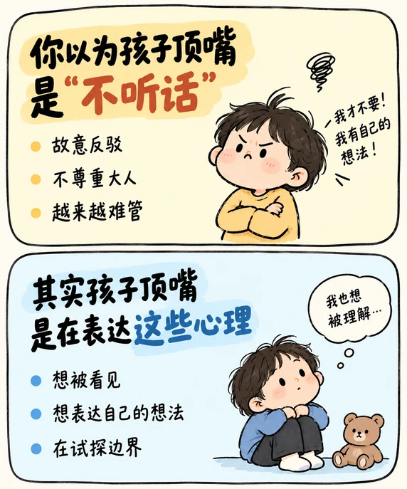
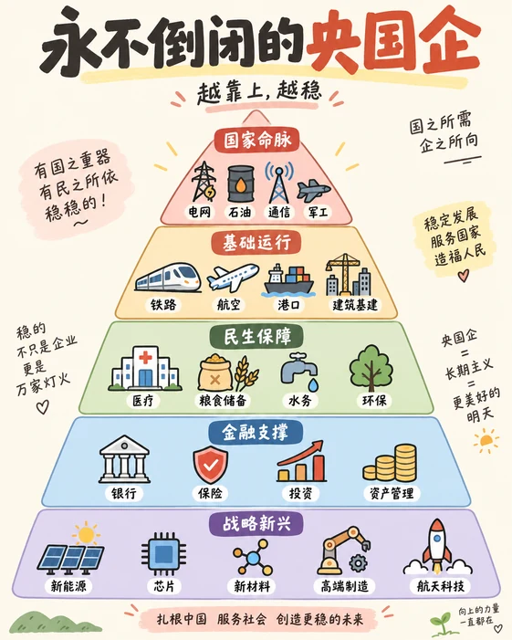
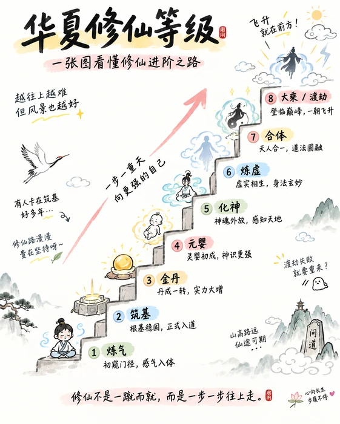
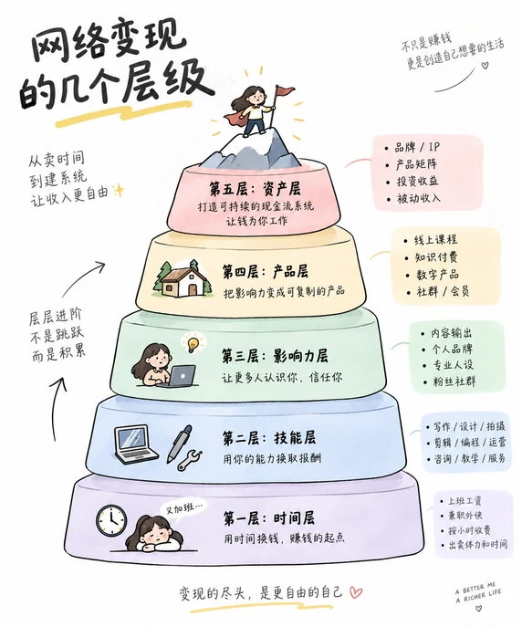
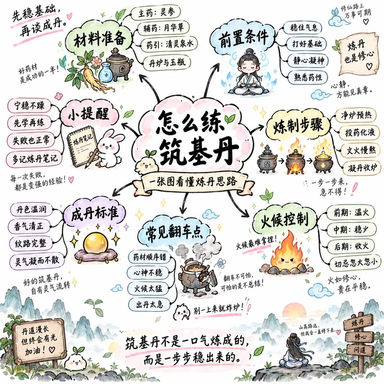
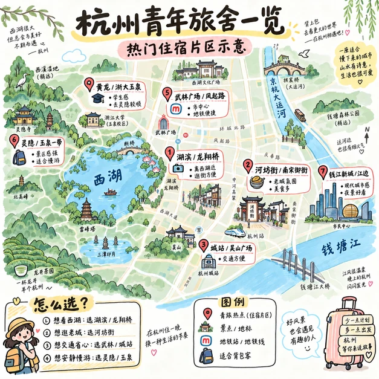
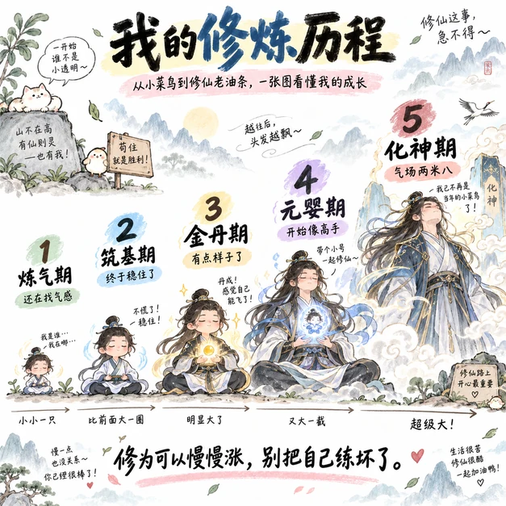
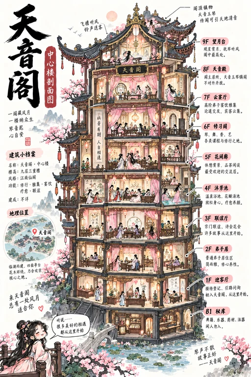

# 社媒卡与信息图排版目录

来源：[yang0/handraw-style](https://github.com/yang0/handraw-style/tree/69b159c0a9b693f7b90dab856eef02466938b27d)，版本 `69b159c0a9b`。以该版本的 layouts.json 和中英提示词文件为准；所有预览已保存本地。

社媒卡 19 种、信息图 32 种；原库没有 SC-013。仅按需读取相应条目，排版提示词不是待展示文案。

## 社媒卡

### SC-001 · 上文下图社媒卡

小红书社媒卡。排版采用上文下图结构：上方集中放置主题文字和简短补充文案，下方放置完整主图或场景图。上下内容保持清晰的阅读顺序，图文关系自然，整体构图简洁。

### SC-002 · 文案主导底部辅助图卡

小红书社媒卡。排版：视觉主体是文字，底部简单图案起辅助作用，图文之间有较大空间。纯色背景，较多留白空间，构图简单。

### SC-003 · 上下双格图文卡

小红书社媒卡。排版：无独立标题，根据主题创作。上下带框两宫格，每一格都是上面一行字，下面配图，图文无明显分界，纯色背景，较多留白空间，角色高度概括，构图简单。

### SC-004 · 上下双格图文分区卡

小红书社媒卡。排版：无独立标题，根据主题创作。上下带框两宫格，每一格都有一个图区和一个文字区，文字区可以在图的上方、左侧或右侧，文字区显示简单文案不做过多扩写，纯色背景，较多留白空间，角色高度概括，构图简单。

### SC-005 · 气泡文字思考IP卡

小红书社媒卡。排版：无独立标题，视觉重点是使用主题的气泡文字，左下或右下放置一个思考状 IP 形象，构图简单，大面积留白。

### SC-006 · 三层标题辅助图卡

小红书社媒卡。排版分为三层：上层放置主标题，中层放置一张尺寸较小、起辅助作用的简单图形，下层放置副标题。使用纯色背景，保留较多留白空间，整体构图简单。

### SC-007 · 引号关键词文字卡

小红书文字型社媒卡。排版：左上放置一个醒目的双引号，中间呈现主题文案并将关键词重点化，右下放置一条下划线；句末可以添加与文字大小适配的 emoji。保持文字主导的简洁构图。

### SC-008 · 图上文下留白卡

小红书社媒卡。排版采用图上文下结构，上方是高度概括的角色或场景图，下方是主题文案；图文之间不设置明显界线，让视觉自然衔接。使用纯色背景，保留较多留白空间，整体构图简单。

### SC-009 · 居中文字右下辅助图卡

小红书文字型社媒卡。排版：主题文字作为视觉主体，居中显示；右下角放置一个简单的小图作为辅助，不抢夺文字的视觉重点。整体构图简洁。

### SC-010 · 上下双格标题列表卡

小红书社媒卡。排版：无独立标题，根据主题创作上下带框的两宫格。每一格包含一行标题、约两三行的简短 list 文字和一张简单配图；文字保持简洁，不做过多扩写，图文之间不设置明显分界。使用纯色背景，保留较多留白空间，角色高度概括，整体构图简单。

### SC-011 · 中心主图多场景信息卡

小红书社媒卡。排版：设置一个主标题，画面中央放置一个主图，周围安排 3–5 个与主体形象一致的简单信息图，并添加 2–3 个对主体的简短标注。使用纯色背景，保留较多留白空间，角色高度概括，整体构图简单。

### SC-012 · 中心标题上下图标卡

小红书社媒卡。排版：标题垂直居中显示，标题上方整齐安排两行图标，标题下方也整齐安排两行图标，形成围绕中心标题的上下对称结构。保持图标排列清晰、构图简单。

### SC-014 · 留白驱动主视觉信息卡

小红书社媒卡。整体保留大面积留白。顶部设置 1–2 行醒目的短标题，与主体区域形成清晰层级；中下部设置一个占据主要面积的大型主视觉，主视觉可居中、偏左或偏右，不固定位置，并通过主体自身的轮廓、姿态和占位关系自然形成若干留白区域。将 4–6 个尺寸较小的信息单元穿插在这些留白区域中，每个单元由一个小视觉元素与极短文字组成，位置服从主视觉留下的空间，不平均环绕主体，不形成规则左右分栏。小信息单元应明显小于主视觉并贴合主体轮廓的空隙，可上下错落、疏密变化，不能使用统一卡片框、规则宫格、表格或明显分割线。底部可保留一句很短的总结文字作为收尾。整体强调主视觉优先、留白驱动、信息穿插，画面完整而非模块拼接。

### SC-015 · 上下双区递进短句卡

小红书社媒卡。整体采用上下两段式结构，将画面分成两个面积接近的独立内容区域，中间保留清晰间距或细分隔关系。两个区域使用统一的视觉语言和相近的内部结构，形成对照、前后、转折或递进关系。每个区域设置一个醒目的核心短句作为第一视觉层级，并安排一个尺寸明显较大的单一主视觉，与核心文字形成左右或斜向的非对称平衡；主视觉位置可根据留白和整体重心调整。核心文字与主视觉之外的剩余留白中，放置 2–4 行简短补充文字，不形成独立卡片或规则列表。上下两个区域保持相似的视觉重量和阅读节奏，但不要求完全镜像复制，可通过标题位置、主视觉方向或留白分布产生轻微变化；第二个区域可加入很短的过渡词、转折词或关系提示。整体强调“上下双区＋大短句＋单一主视觉＋少量补充说明”，避免复杂信息图、密集文字、规则宫格和过多装饰，保持大面积留白、层级清楚、手机端快速阅读。

### SC-016 · 极简大字小图点缀卡

小红书社媒卡。整体采用极简的大留白结构，以一组大字号短文案作为绝对视觉主体。主文案放置在画面上半部或中上部，占据主要横向宽度，可使用 2–3 行自然换行；文字整体偏左排列，但不紧贴边缘，形成稳定的大块文字区域。主文案字号明显大于其他元素，行距相对紧凑，个别关键词可通过颜色、字重、底纹或轻微标记进行局部强调，但不要让多个词同时抢夺注意力。主文案下方保留较大的空白距离，在中央或略偏一侧放置一个尺寸很小的视觉点缀，作为第二视觉停顿，不承担主要信息。画面四角可以加入极少量微型辅助信息，例如日期、页码、符号或装饰点，字号和视觉重量都非常低。整体不设置卡片框、分栏、信息列表或复杂图文组合，背景保持简洁，强调大文字、少元素、大留白、弱装饰，形成轻盈安静、适合快速阅读的社媒封面感。

### SC-017 · 自由标注留白信息卡

小红书社媒卡。排版：设置一个主标题，标签文字以自由、自然的方式分布在画面中，对画面里的角色、物件或场景元素做出简短注解，让文字参与整体构图。保留大面积留白，角色高度概括，减少装饰和复杂分区，保持构图简洁。

### SC-018 · 中心主视觉环绕信息卡

小红书社媒卡。排版采用中心主视觉环绕式结构：顶部设置两级短标题，其中主标题醒目。画面中央放置一个占比最大的主体人物或物体，作为绝对视觉中心；主体四周分散安排 3–6 个尺寸较小的独立插图，每个小图旁仅配一个极短标签或事项名称。小图采用自由、不规则的环绕分布，左右和下方错落排布，保持视觉平衡而非整齐网格。背景保留大面积留白，主图、小图、文字之间保持明显间距，形成“一大主体＋多个小信息点”的层级关系。

### SC-019 · 中央人物细线标注卡

小红书社媒卡。排版采用“顶部标题＋中央大人物＋左右零散标签”的三级结构。画面顶部放置一句醒目的短标题，字号最大，居中或略偏左。画面中央放置一个完整人物作为绝对视觉主体，人物占画面高度约 60%–75%，从中上部延伸到底部，保持完整轮廓。人物左右两侧分散安排 3–5 个极短标签，每个标签仅一行或短词组，并用简短细线、斜线或引导线指向人物附近对应位置。标签上下错落、自由分布，左右保持视觉平衡，不做成规则列表。人物与文字之间保留充足间距，不遮挡人物主体。背景大面积留白，不增加复杂图块、卡片框、表格或多余装饰，确保手机端一眼可读。

### SC-020 · 一大一组非对称信息卡

小红书社媒卡。整体采用“一大一组”的非对称结构。顶部设置 1–2 行醒目的短标题，形成独立标题区域，并与下方主体保持明显间距。中部设置一个占据主要面积的大型主视觉，整体偏向画面一侧；在相对另一侧集中安排 4–6 个尺寸明显更小的信息单元，形成连续、紧凑的次级信息组。主视觉可以位于左侧或右侧，信息组随之镜像调整，不固定具体方向。小信息单元不环绕主视觉四周，也不分散到画面两侧，可上下错落、两列穿插或疏密变化；每个单元由一个小视觉元素与极短文字组成。主视觉区域约占中部内容面积的 55%–70%，信息组约占 25%–40%，两者通过留白自然分隔，不使用分栏线、统一卡片框、表格或规则宫格。底部可保留一行很短的总结文字。整体强调“一个大视觉块＋一个集中小信息簇”，版面非对称但稳定，避免中心辐射、四周环绕、平均分布或满画面散点排版。

## 信息图

### IG-001 · 标题金字塔图标信息图

小红书信息图。排版：顶部设置明确标题，主体采用层级递进的金字塔示意图，每一层包含多个带标签的图标，使用分层结构清晰表达信息关系。

### IG-002 · 中心主图标注信息图

小红书信息图。排版：主图放在画面中央，周围环绕多个带线标签的注释，连接线分别指向主图的具体部位，对主体结构或细节进行清晰标注说明。

### IG-003 · 多行左右对比信息图

小红书信息图。排版：顶部设置主标题，主体由多行对比内容组成，每一行采用左侧文字、右侧图片的固定结构，保持各行对齐并形成清晰的逐行比较关系。

### IG-004 · 双列多行对比信息图

小红书信息图。排版：顶部设置主标题，主体分为左右两列进行对比，每列内部包含多行对应内容；保持两列结构清晰、行项相互对齐，突出不同对象之间的逐项比较关系。

### IG-005 · 大主视觉下方图鉴信息图

小红书信息图。整体采用“顶部超大标题＋中部大型结构主视觉＋下部图鉴式分类单元”的纵向结构。顶部设置一行醒目的大标题，字号明显大于其他文字，横向展开，占据独立标题区，并与下方内容保持清晰间距。画面中部放置一个尺寸很大的完整主视觉，占据画面主要宽度，作为整张卡片的核心；主视觉内部可根据自身结构划分若干区域，并直接嵌入简短标签，使文字与主视觉形成一体化标注，不拆成多个独立卡片。画面下部排列多个尺寸较小的独立视觉单元，采用规则但不过分拥挤的多列布局，每个单元由“小视觉＋下方短标签”组成，尺寸尽量统一，横向和纵向间距稳定，形成图鉴、目录或分类展示的扫描节奏。小单元数量可以较多，但必须明显小于中部主视觉，不使用复杂卡片框，依靠留白、对齐和重复结构建立秩序。整体阅读顺序为顶部标题→中部整体结构→下部细分类单元，避免左右分栏、复杂装饰和不规则拼贴。

### IG-006 · 多层标题图标对比信息图

小红书信息图。排版：设置一个主标题，主体由多个层级组成，每一层左侧放置该层标题，右侧整齐排列多个带文字标签的图标，用于呈现不同层级之间的对比关系。使用纯色背景，保留较多留白空间，整体构图简单。

### IG-007 · 粗体标题标签小图卡

小红书信息图。排版：粗体标题，多行带标签小图，底部一行字，纯色背景，无框，较多留白空间。

### IG-008 · 多路径流程步骤图

小红书信息图。排版：设置一个主标题，主体采用流程步骤图结构，步骤路径可以是横向、纵向、S 形或其他清晰的路径式布局。每一步只包含一个小图和一句简短说明，步骤之间通过方向、顺序或适度引导关系连接。保留大面积留白，避免复杂装饰和过多文字。

### IG-009 · 时间轴节点信息图

小红书信息图。排版：设置一个主标题，主体采用时间轴型结构，用一条清晰的主轴串联多个节点。时间轴可以横向或纵向展开，每个节点包含一个小图、一个时间信息和一句简短说明。保持节点顺序清楚、层级明确，并保留大面积留白，避免复杂装饰和过多文字。

### IG-010 · 阶段等级进阶信息图

小红书信息图。排版：阶段进阶型，重点展示由低到高的等级变化和阶段提升，不以时间先后为组织依据。顶部设置简短醒目的主标题，主体可采用阶梯、上升箭头或清晰的层级结构，使进阶方向一目了然。各阶段配简洁小图、等级名称和简短说明，层级关系清楚，文字从简。保留大面积留白和舒适的阶段间距，构图简洁。

### IG-011 · 前后变化对比信息图

小红书信息图。排版：Before / After 型，前后变化是绝对视觉重点。将画面组织为前后两个主要区域，可以左右排列，也可以上下排列；两部分之间只放箭头、日期或极少量说明，用来表达变化方向。Before 与 After 各自呈现完整、可直接比较的主视觉，标签和文字保持简洁。保留大面积留白，避免复杂装饰和过多辅助信息。

### IG-012 · 分层结构型信息图

小红书信息图。排版：分层结构型，围绕天然存在的层级关系组织信息，可以表现为上中下、内中外、表层深层或由基础到核心的多层结构。设置清晰的主标题，主体通过层层嵌套、上下分层或由下至上的结构展示不同层级；每一层配简洁名称、短句或小图，保持层级顺序和阅读关系明确。保留大面积留白，避免复杂装饰、过密文字和无关模块。

### IG-013 · 漏斗转化型信息图

小红书信息图。排版：漏斗型，上宽下窄，通过逐层收窄的结构展示从广泛进入、筛选、转化、淘汰到聚焦沉淀的过程。设置清晰的主标题，漏斗各层配简洁的阶段名称、短句或小图，突出人数、对象或范围逐步减少而重点逐步集中的关系。层级顺序应清楚，保留大面积留白，避免复杂装饰和过多文字。

### IG-014 · 四象限矩阵信息图

小红书信息图。排版：矩阵型，以两条相互垂直的轴将内容划分为四个象限，优先采用清晰易读的 2×2 结构。设置一个主标题，并明确标注横轴、纵轴及其两端含义；每个象限放置一个主题单元，可包含简短标题、小图和少量说明。四个区域保持对齐、间距均衡和比较关系明确，保留大面积留白，避免复杂装饰和过多文字。

### IG-015 · 坐标散点型信息图

小红书信息图。排版：坐标散点型，在一个清晰的坐标空间中散布多个不同对象，通过它们在横轴和纵轴上的位置表达分类、倾向或关系。设置一个主标题，明确标注横轴、纵轴及两端含义；每个对象由简洁的小图、名称和少量说明组成，位置分布应有辨识度并便于比较。保留坐标区域周围的大面积留白，避免复杂装饰和过多文字。

### IG-016 · 分类树状型信息图

小红书信息图。排版：分类树 / 树状型，从一个核心大类或根节点开始，向下分成若干主要小类，再继续分解为更细的子类或末端节点。设置清晰的主标题，根节点位于顶部或中心上方，各级节点通过连线体现所属关系和分支路径。每个节点使用简短名称或极少说明，层级深度、分支顺序和阅读路径必须清楚。保留适度留白，避免过度装饰和无关信息。

### IG-017 · 思维导图型信息图

小红书信息图。排版：思维导图型，中心主题作为核心节点，向外延伸多条分支；每条分支包含若干短标签或小图标，清楚表达从中心到子主题的层级关系。避免规则表格和过密文字，使用自然弯曲的连线、适度留白和简洁角色概括形成清晰阅读路径。

### IG-018 · 关系网络型信息图

小红书信息图。排版：关系网络型，多个对象分布在画面中，用不同颜色或粗细的连线表达合作、影响、依赖或关联关系。可以只有弱中心，不要求所有节点平均分布；节点名称保持简短，整体留白充足，避免复杂表格和密集说明。

### IG-019 · 循环闭环型信息图

小红书信息图。排版：循环闭环型，多个阶段围成圆形或环形路径，用连续箭头串联，强调持续循环、反馈和迭代，而不是开始到结束的单向流程。中心保留标题或核心结论，节点配小图和短句，留白清楚，避免拥挤。

### IG-020 · 路径地图型信息图

小红书信息图。排版：路径地图型，一条弯曲、蜿蜒或游戏地图式路线贯穿画面，沿途安排多个编号节点、地点或阶段。每个节点配一个小视觉和一句短说明，用箭头、虚线或路标表达探索方向；不必是真实地图，重点是路径和节点关系，保留大面积留白。

### IG-021 · 真实地图标注型信息图

小红书信息图。排版：真实地图与标注型，以真实地图轮廓、街区、水系或区域关系作为主视觉，在地图上放置地点标记、极短说明和少量小图标。标注需避开主体遮挡，层级清楚，图例简洁，避免把地图做成密集列表。

### IG-022 · 数字大字型信息图

小红书信息图。排版：数字大字型，以一个或多个超大数字作为绝对视觉主体，周围只放极短解释、单位或对象名称。数字要占据主要面积并形成强烈冲击，其他元素弱化，背景大面积留白，不加入复杂图表。

### IG-023 · 排行榜型信息图

小红书信息图。排版：排行榜型，按1、2、3、4、5的明确顺序排列对象。每个对象配一个小图、名称和一项核心数据，可采用纵向排行、奖台或错落分层结构。重点突出名次差异和第一视觉对象，避免退化成普通无序清单。

### IG-024 · 比例构成型信息图

小红书信息图。排版：比例构成型，使用圆环图、饼图、100人图标或色块面积表达整体中各部分所占比例。设置清晰图例和少量百分比标注，主图最大，说明简短，颜色区分明确，留白充足，避免堆叠过多指标。

### IG-025 · 尺度比较型信息图

小红书信息图。排版：尺度比较型，让多个对象按真实或相对大小从小到大排列，视觉尺寸本身直接传递比较信息。对象高度概括，配极短名称或阶段标签，用基线、箭头或少量刻度强化递进关系，保持构图简单和大面积留白。

### IG-026 · 拆解爆炸图型信息图

小红书信息图。排版：拆解爆炸图型，一个完整物体作为主体，多个零件或组件从主体中分离并围绕主体展开，用引导线说明每个组件的名称、用途或组成关系。重点表现“由什么组成”，不要做成普通标注图；角色高度概括，构图简单，大量留白。

### IG-027 · 剖面截面型信息图

小红书信息图。排版：剖面 / 截面型，把一个整体建筑或物体切开，直接展示内部空间、楼层和功能分区。剖面主视觉占据主要面积，旁侧配置少量楼层标签或极短说明，切口和内部结构必须完整可读，角色高度概括，保留大量留白。

### IG-028 · 连续场景信息图

小红书信息图。排版：连续场景型，整张图是一幅连贯的空间或时间场景，多个信息节点自然藏在道路、人物、建筑和道具中。不要拆成卡片或规则网格；用场景关系串联信息，角色高度概括，构图简洁，保留大片天空、地面或背景留白。

### IG-029 · 人物群像标签型信息图

小红书信息图。排版：人物群像 + 标签型，多个角色自由站位，不必形成规则宫格。每个角色配一个短标签或极短说明，角色之间保持清楚间距和视觉平衡，可用姿态、道具和大小差异表达区别。角色高度概括，背景大面积留白，避免复杂装饰。

### IG-030 · 一大多小知识图谱型信息图

小红书信息图。排版：一大多小知识图谱型，设置一个占据主要面积的大型核心图，作为画面最重要的视觉主体；在核心图周围分布若干尺寸明显更小的视觉单元，每个单元配一个极短标签、名称或说明。小单元围绕核心主题形成知识关联，但不要求规则网格或完全平均分布；通过留白、位置和适度连接表达整体关系。角色高度概括，构图简单，保留大量留白。

### IG-031 · 百科全书式信息卡

小红书信息图。排版：百科全书式信息卡。采用“顶部主标本展示区 + 中部非对称多模块信息区 + 底部资料来源区”的三段式结构。顶部以主视觉实物/标本为核心，搭配标题、学名/副标题、分类标签与少量基础信息。中部通过细线网格、坐标系统和黄金分割组织6–10个信息模块，混合小标题、短文、图解、对比、数据条、地图、时间轴等形式，整体图文混排、秩序清晰、留白充足。底部设置弱化的编号、注释或来源说明区，整体呈现标本馆档案与现代博物馆导览牌融合的理性设计感。

### IG-032 · 手绘编辑式知识信息图

小红书信息图。排版：手绘编辑式知识信息图。采用“顶部超大标题 + 中部大型核心主视觉 + 周边多个带数字编号的知识点模块 + 底部总结区”的构图。核心主视觉明显大于其他元素，作为全图视觉中心；周围自然环绕分布4–8个知识点模块，每个模块带有清晰醒目的数字序号（如01、02、03、04）建立列表感与阅读动线。每个编号模块包含短标题、简短说明和一个小型视觉解释（如小场景插图、图标、对比、流程、思维泡泡或微型漫画）。模块围绕核心视觉灵活排布，非僵硬规则宫格，允许箭头、标签、对话气泡与手写注释穿插连接。底部设置一句话总结、关键词提炼或checklist清单区收束全图。整体呈现杂志编辑插画、知识信息图与轻漫画叙事融合的生动手绘质感。角色高度概括，构图简洁，较多留白。
